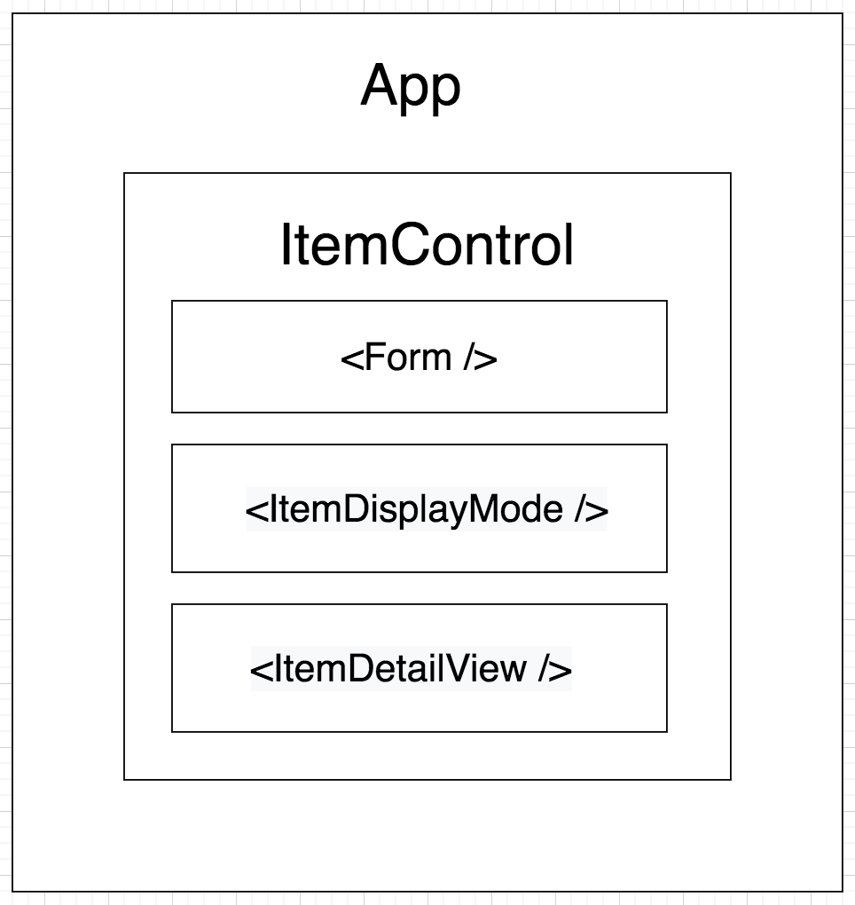

## AunTea's Organics Tea Shop

#### Winter A. Runion, 4.19.2020

### Description
_An interactive menu for a fictional tea shop, powered by React. Created to practice passing props and managing state. An Epicodus independent project._


### Component Diagram



### Instructions

You can see the program in action [here](https://wrunion.github.io/epicodus-react-project/). Alternatively:

* ```Git clone``` [this repo](https://github.com/wrunion/epicodus-react-project.git) to your local machine.
* CD into the project folder, and run ```npm install```. This will give you all the node modules you need to run the app.
* Run ```npm start``` to spin up a local server.
* Open the repo in the code editor of your choice, and make changes as you wish.
* Edit and enjoy!

### Technologies Used
* HTML/CSS/JavaScript
* Webpack
* React

### Contact
You're welcome to submit a pull request if you find any issues.

### License
The MIT License (MIT)

**Copyright (c) 2020 Winter A. Runion**